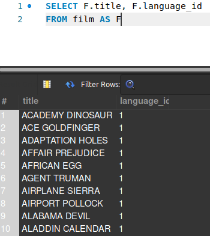
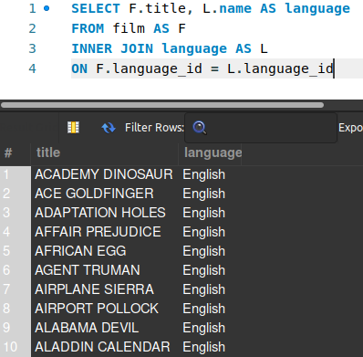
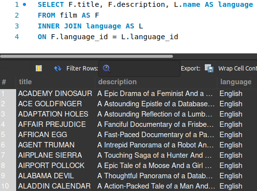

## INNER JOIN

Como já comentado, o ``JOIN`` é uma ferramenta do SQL para manipularmos dados que se encontram em diferentes tabelas. O mais comum e genérico é o ``INNER JOIN``, que vamos tratar logo abaixo.

A sua sintaxe básica para acoplar duas tabelas é:

> SELECT *tabela1.nome-coluna, tabela2.nome-coluna, . . .*  
> FROM tabela1  
> **INNER JOIN** tabela2  
> **ON** tabela1.coluna-chave-estrangeira = tabela2.coluna-referencia

Mas também é possível apelidar as tabelas, utilizando um **AS** (*alias*). Dessa forma, conseguimos utilizar o nome da tabela como o apelido dela, enxugando um pouco mais a *query*:

> SELECT *t1.nome-coluna, t2.nome-coluna, . . .*  
> FROM tabela1 **AS** *t1*  
> **INNER JOIN** tabela2 **AS** *t2*  
> **ON** t1.coluna-chave-estrangeira = t2.coluna-referencia  
>
>  > Vale ressaltar que é possível colocar quantas colunas fizerem sentido após o SELECT. No entanto, o MySQL trará os dados da tabela explicitada antes do nome da coluna.  
>  >Por exemplo: caso haja uma coluna **name** na tabela1 e na tabela2, o MySQL trará os dados da tabela que foi explicitada antes do nome da coluna.

Agora, que tal trazer um exemplo para clarear o que foi falado? Vamos juntos?!

Esse exemplo foi baseado no banco de dados do [Sakila](https://assets.app.betrybe.com/back-end/sakila-1ae15ae82697888c35bf1f1c8acbf755.sql). 

O primeiro passo é selecionarmos as colunas que queremos da primeira tabela, se atentando sempre para obedecer à sintaxe: *tabela **.** nome-coluna*, como mostra a imagem abaixo:

Quando conseguirmos trazer o resultado da *query*, sem erros, vamos ao segundo passo.

Agora vamos acoplar a tabela principal que contém a *foreign key* à tabela secundária, que contém os dados que queremos acoplar. Para isso, vamos apenas acrescentar o ``INNER JOIN`` e o ``ON``, como mostra a imagem abaixo:

É esperado que o MySQL nos traga o mesmo resultado, sem acusar erro.  

Repare que logo após o ``ON``, é informado qual é a coluna que representa a *foreign key* na tabela principal e qual é a coluna que ela aponta na tabela secundária.

Com esta etapa concluída com sucesso, sem erros, as nossas tabelas estão acopladas com **SUCESSO!**

> **UHULLL!!!**

De agora em diante, basta apenas alterar o nome da tabela com o nome da sua respectiva coluna. No exemplo, tiramos o id da linguagem que o filme foi feito para deixar apenas o nome da linguagem, dando um apelido de *language* para esta coluna.

> *Não fica muito mais legível?*

No nosso último exemplo, adicionamos mais uma coluna ao resultado final, para que você possa entender o quão simples e mágico é manipular dados relacionais com o ``INNER JOIN``! 

Fala sério! Isso não é incrível?

---

### Exercícios de fixação

1. Construa uma *query* que retorne o primeiro nome do cliente (na tabela *customer*) e o número de telefone dele (na tabela *address*).

2. Construa uma *query* que retorne a data do aluguel (na tabela *rental*) e o primeiro nome do cliente que fez o aluguel (na tabela *customer*).

---

#### Explorado o ``INNER JOIN``, vamos agora falar um pouco do ``LEFT JOIN`` e ``RIGHT JOIN``. Pra cima!!! 🚀🚀🚀