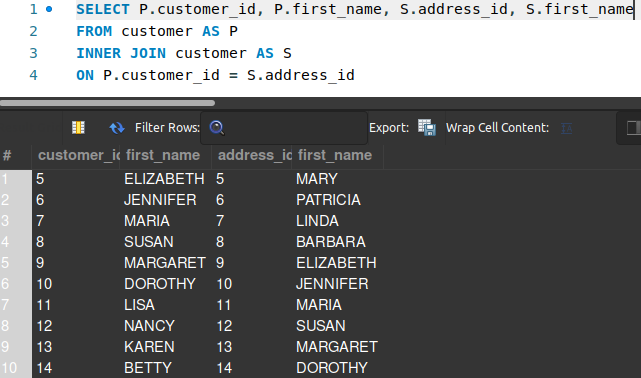

## SELF JOIN

Agora que já vimos os principais tipos de ``JOIN``, te faço uma pergunta:

> *Será que é possível juntar os dados de uma tabela com outros dados advindos desta mesma tabela?*

E a resposta é **SIM**! Para isso, utilizaremos o ``SELF JOIN``!  

Ao contrário do que você está pensando, para utilizar esse recurso, não utilizaremos o ``SELF`` antes do clássico ``JOIN``. Para implementarmos essa utilidade do nosso leque de opções, vamos utilizar o mesmo ``INNER JOIN`` já estudado.

No entanto, ao invés de chamarmos uma tabela diferente, depois do ``JOIN``, chamaremos a própria tabela e a apelidaremos de outra forma, para mantermos o padrão que adotamos até agora. Para ficar mais claro, a sintaxe é feita dessa forma:

> SELECT **P**.nome-coluna, **S**.nome-coluna, . . .  
> FROM **tabela AS P**  
> INNER JOIN **tabela AS S**  
> ON **P**.nome-coluna = **S**.nome-coluna

Para exemplificar, iremos utilizar a tabela *customer*. Digamos que você queira buscar clientes que se relacionam através do próprio id e o endereço do id, para uma dinâmica de sorteio. 

O ``SELF JOIN`` é o mecanismo perfeito para isso! Observe a imagem abaixo, que exemplifica o nosso caso:

Para ajudar a internalizar o conceito: o ``SELF JOIN`` "cria uma cópia" da própria tabela e filtra os dados de acordo com a condição imposta no ``ON``. No nosso exemplo, ele pega o cliente que possui o *customer_id* 1 e o compara com todos os outros clientes cadastrados na tabela. Caso esse *customer_id* seja igual a um ou mais *address_id* da tabela "copiada", ele retorna esses dados na tabela secundária (apelidada de S).

---

### Exercícios de fixação

1. Construa uma *query* que retorne o *id* do aluguel e a data que o filme foi alugado (na tabela *rental*) e o *id* de outro aluguel e a data que esse filme foi devolvido, com a condição da **data** de aluguel ser a mesma **data** de devolução desse outro filme.

> O intuito dessa *query* é ter o controle de qual filme foi alugado na mesma data que um outro filme foi retornado.

---

#### Na próxima etapa, preparamos uma dica para você fixar tudo o que viu até agora. Corre pra lá!