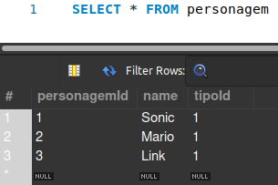
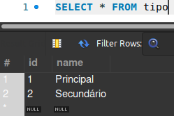
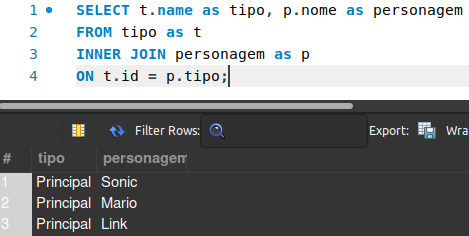
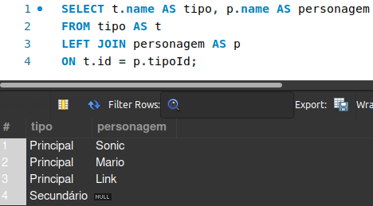

## LEFT JOIN e RIGHT JOIN 

Compreendido o conceito de ``INNER JOIN``, vamos tratar agora outros dois tipos de ``JOINs``: o ``LEFT`` e o ``RIGHT``.

A sintaxe é padrão. Então, como você deve estar imaginando, a única coisa que muda é, de fato, o tipo de ``JOIN`` que estamos chamando. Tomando o nosso último caso como exemplo:

> SELECT *t1.nome-coluna, t2.nome-coluna, . . .*  
> FROM tabela1 as *t1*  
> **INNER JOIN** tabela2 as *t2*  
> **ON** t1.coluna-chave-estrangeira = t2.coluna-referencia

Caso quiséssemos alterar o tipo de ``JOIN``, basta somente alterar o ``INNER`` por ``LEFT`` ou ``RIGHT``, ficando assim:

> SELECT *t1.nome-coluna, t2.nome-coluna, . . .*  
> FROM tabela1 as *t1*  
> **LEFT** JOIN tabela2 as *t2*  
> ON t1.coluna-chave-estrangeira = t2.coluna-referencia
>
> > Ou
>
> SELECT *t1.nome-coluna, t2.nome-coluna, . . .*  
> FROM tabela1 as *t1*  
> **RIGHT** JOIN tabela2 as *t2*  
> ON t1.coluna-chave-estrangeira = t2.coluna-referencia

Dito isso, é dessa forma que alteramos a sintaxe não só para o ``LEFT`` ou ``RIGHT JOIN`` como também para qualquer outro tipo de ``JOIN``!

> *Tá, mas por que eu utilizaria outro tipo de ``JOIN`` se o ``INNER`` já satisfaz as minhas necessidades?*  
> Será mesmo . . . ?

Digamos que você tenha duas tabelas: uma com Personagens e outra que armazena o tipo dos personagens (principal, secundário, etc). Se você quiser retornar **TODOS** os tipos armazenados e trazer também os personagens que estão relacionados com esse tipo, como faria?  

Provavelmente, com o que falamos até aqui, desta forma:  

  

No entanto, há um dado que não foi trazido pelo ``JOIN``, na tabela tipo, que é o valor *'Secundário'*... ***E agora?!*** 🤔  

Para solucionar esse tipo de desafio, utilizamos o recurso do ``LEFT`` ou ``RIGHT JOIN``, a depender de qual tabela é tida como referência. Observemos o mesmo exemplo, mas agora trocando o ``INNER`` pelo ``LEFT``:  

  

Desta forma, mesmo não havendo nenhum personagem com aquele tipo, a *query* retorna **TODOS** os valores da tabela tipo. E os que não possuem correspondência, é preenchido com *null* (nulo).

Portanto, de agora em diante, caso queiramos trazer todos os dados de uma tabela específica, acoplada a outra tabela, basta usar o ``LEFT`` ou ``RIGHT JOIN``!   

>Se a tabela principal for a nossa referência, utilizamos o ``LEFT JOIN``. Se for a tabela secundária (que vem após instanciarmos o ``JOIN``), utilizamos o ``RIGHT JOIN``.

#### Agora, você possui o ``INNER``, ``LEFT`` e o ``RIGHT`` no canivete de ``JOINS``. Vamos também adicionar o ``SELF``?! 