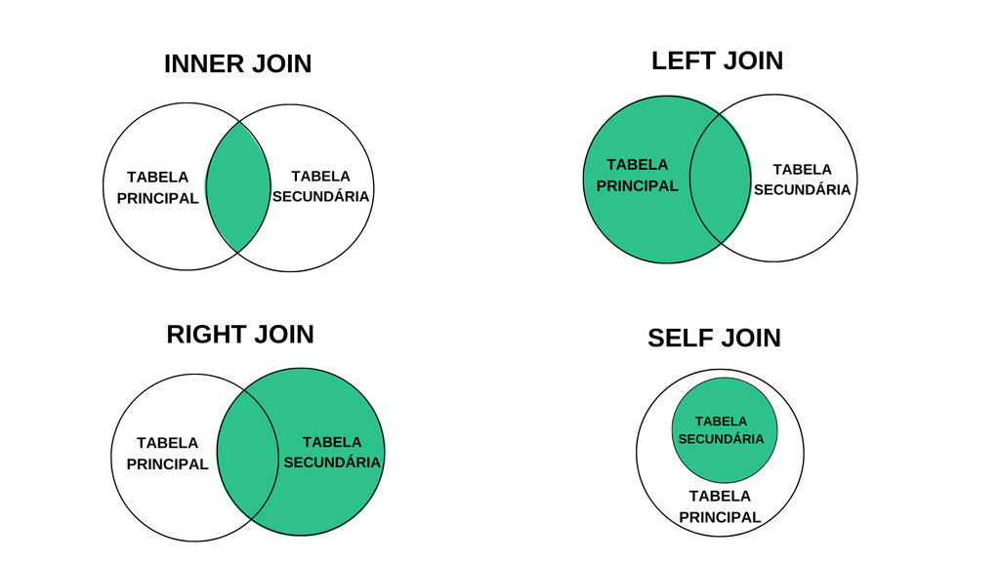

## Fixando conteúdo

Para que o conteúdo fique ainda mais nítido e fixado, essa foto representa muito bem o que cada ``JOIN`` do teu leque de possibilidades faz. Acompanhe as dicas abaixo e faça o link com a imagem:  

- Se o objetivo for trazer **somente** o conteúdo que corresponde à condição que foi explicitada após o ``ON``, o ``INNER JOIN`` é a tua escolha!  

- Por outro lado, se o objetivo for trazer **todo** o conteúdo da tabela principal e as correspondências da condição na secundária, vai de ``LEFT JOIN``!  

- Já se a finalidade for trazer **todo** o conteúdo da tabela secundária e as correspondências da condição na principal, a sua escolha é o  ``RIGHT JOIN``!  

- Por último, caso os dados que queira acoplar e filtrar, de acordo com a condição, estejam na mesma tabela, é o ~~``INNER``~~ ``SELF JOIN``!  

Depois de tratarmos sobre os principais tipos de ``JOIN``, conseguimos aplicar o conceito de *Banco de Dados **Relacional*** na prática, conseguindo, de fato, relacionar os dados entre tabelas e trazer as informações que precisamos em um só resultado!  

#### Agora que todo o conteúdo foi consumido, vamos para a aula ao vivo?! 🔴🎥