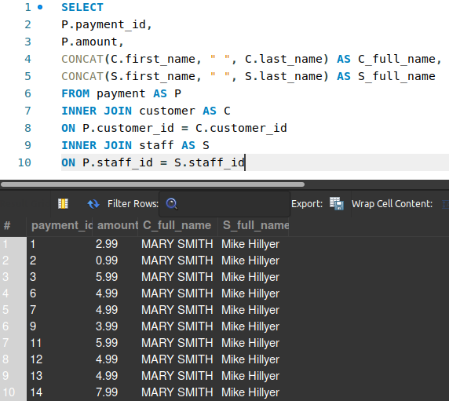

## Gabarito - ``JOIN``

### Fixação

Gabarito referente aos exercícios de fixação durante o conteúdo:

#### INNER JOIN

1. > **SELECT** C.first_name, A.phone  
**FROM** customer **AS** C  
**INNER JOIN** address **AS** A  
**ON** C.address_id = A.address_id

2. > **SELECT** R.rental_date, C.first_name  
**FROM** rental **AS** R  
**INNER JOIN** customer **AS** C  
**ON** R.customer_id = C.customer_id  

#### LEFT JOIN & RIGHT JOIN

1. > **SELECT** P.amount, R.rental_id  
**FROM** payment **AS** P  
**LEFT JOIN** rental **AS** R  
**ON** P.rental_id = R.rental_id  

2. > **SELECT** P.amount, R.rental_id  
**FROM** payment **AS** P  
**RIGHT JOIN** rental **AS** R  
**ON** P.rental_id = R.rental_id   

> ***Reflexão:***
>
> Quando utilizamos o ``LEFT`` ou o ``RIGHT``, a resposta à *query* contém **todos** os dados da tabela referência. Portanto, como na tabela *payment* há alguns valores de *rental_id* nulos, ele traz o valor que foi cobrado naquela transação e o *rental_id* nulo, já que nas regras de negócio foram estabelecidas que esse valor, **na tabela *payment*** poderia ser nulo.  
> Já quando utilizamos o ``RIGHT``, mudamos a tabela de referência para a *rental*. Logo, como o *rental_id* nesta tabela é uma *primary key*, esse valor não pode ser nulo. Por isso, os valores nulos retornados no exercício 1 com o ``LEFT JOIN`` não são retornados no exercício 2, utilizando o ``RIGHT JOIN``.

#### SELF JOIN

1. > **SELECT** P.rental_id, P.rental_date, S.rental_id  , S.return_date   
**FROM** rental **AS** P  
**INNER JOIN** rental **AS** S  
**ON** DATE(P.rental_date) = DATE(S.return_date)  

---

### Vamos praticar

Gabarito referente aos exercícios do *Agora é a sua vez* sobre ``JOIN``:

#### INNER JOIN

1. > **SELECT** CONCAT(C.first_name, " ", C.last_name) **AS** full_name, A.address  
**FROM** customer **AS** C  
**INNER JOIN** address **AS** A  
**ON** C.address_id = A.address_id  

2. > **SELECT** A.district, C.city  
**FROM** address **AS** A  
**INNER JOIN** city **AS** C  
**ON** A.city_id = C.city_id  

3. > **SELECT** F.title, C.name **AS** category  
**FROM** film **AS** F  
**INNER JOIN** film_category **AS** FC  
**ON** F.film_id = FC.film_id  
**INNER JOIN** category as C  
**ON** FC.category_id = C.category_id  

4. > **SELECT** F.title, F.description, CONCAT(A.first_name, " ", A.last_name) **AS** full_name  
**FROM** film **AS** F  
**INNER JOIN** film_actor **AS** FA  
**ON** F.film_id = FA.film_id  
**INNER JOIN** actor **AS** A  
**ON** FA.actor_id = A.actor_id  

#### LEFT JOIN & RIGHT JOIN

5. > **SELECT** CONCAT(S.first_name, " ", S.last_name) **AS** full_name, A.address  
**FROM** staff **AS** S  
**LEFT JOIN** address **AS** A  
**ON** S.address_id = A.address_id  

6. > **SELECT** CONCAT(S.first_name, " ", S.last_name) **AS** full_name, A.address  
**FROM** staff **AS** S  
**RIGHT JOIN** address **AS** A  
**ON** S.address_id = A.address_id  

> ***Reflexão:***
>
> Quando feito com o ``LEFT JOIN``, o SQL retornar os dados tomando como base a tabela *staff*. Portanto, é retornado apenas o nome completo dos dois *staffs* e os seus respectivos endereços.  
> Por outro lado, quando feito com o ``RIGHT JOIN``, a tabela base se torna a *address*, trazendo, primarimente, **todos** os endereços. E, como visto no conteúdo, os endereços que não possuem relação com algum *staff* são preenchidos com *null*.

7. > **SELECT** CI.city, CO.country  
**FROM** city **AS** CI  
**LEFT JOIN** country **AS** CO  
**ON** CI.country_id = CO.country_id  

8. > **SELECT** CI.city, CO.country  
**FROM** city **AS** CI  
**RIGHT JOIN** country **AS** CO  
**ON** CI.country_id = CO.country_id  

> ***Reflexão:***
>
> Quando feito com o ``LEFT JOIN``, o SQL retornar os dados tomando como base a tabela *city*. Portanto, eles vêm exatamente como mostrados nessa tabela.  
> Por outro lado, quando feito com o ``RIGHT JOIN``, a tabela base se torna a *country*, trazendo, primarimente, os dados como estão dispostos nela. Como há menos países do que cidades, ele trás todas as cidades de um país antes de passar pra outro, sempre seguindo a ordem da tabela *country*.

#### SELF JOIN

9. > **SELECT** P.address_id, P.address, S.city_id, S.address  
**FROM** address **AS** P  
**INNER JOIN** address **AS** S  
**ON** P.address_id = S.city_id  

10. > **SELECT**  
CONCAT(P.first_name, " ", P.last_name) **AS** P_full_name,  
CONCAT(S.first_name, " ", S.last_name) **AS** S_full_name  
**FROM** customer **AS** P  
**INNER JOIN** customer **AS** S  
**ON** P.first_name = S.last_name    

#### Bônus

11. > **SELECT**  
P.payment_id,  
P.amount,  
CONCAT(C.first_name, " ", C.last_name) **AS** C_full_name,  
CONCAT(S.first_name, " ", S.last_name) **AS** S_full_name  
**FROM** payment **AS** P  
**INNER JOIN** customer **AS** C  
**ON** P.customer_id = C.customer_id  
**INNER JOIN** staff **AS** S  
**ON** P.staff_id = S.staff_id   

12. > **SELECT**  
CONCAT(C.first_name, " ", C.last_name) **AS** full_name,  
A.address,  
CI.city,  
CO.country  
**FROM** customer **AS** C  
**INNER JOIN** address **AS** A  
**ON** C.address_id = A.address_id  
**INNER JOIN** city **AS** CI  
**ON** A.city_id = CI.city_id  
**INNER JOIN** country **AS** CO  
**ON** CI.country_id = CO.country_id  
**ORDER BY** full_name  

